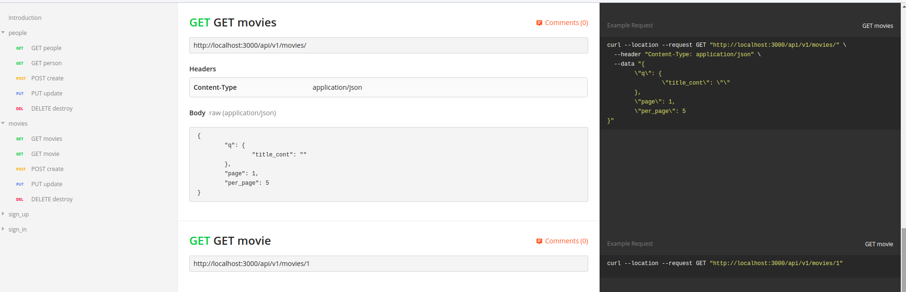
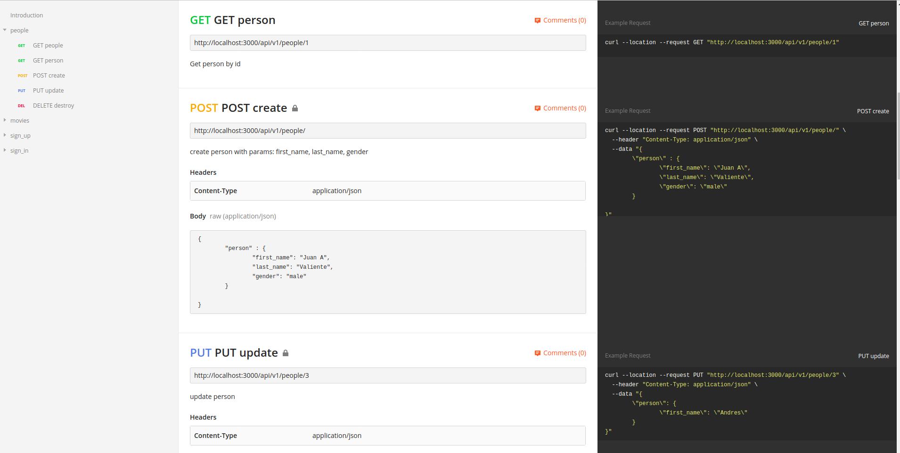
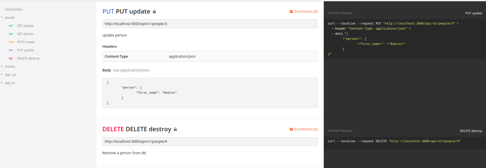
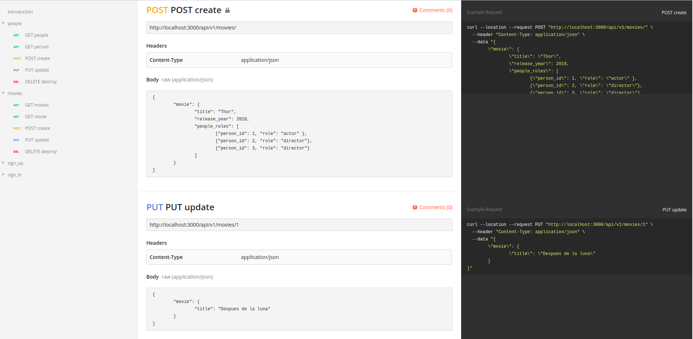
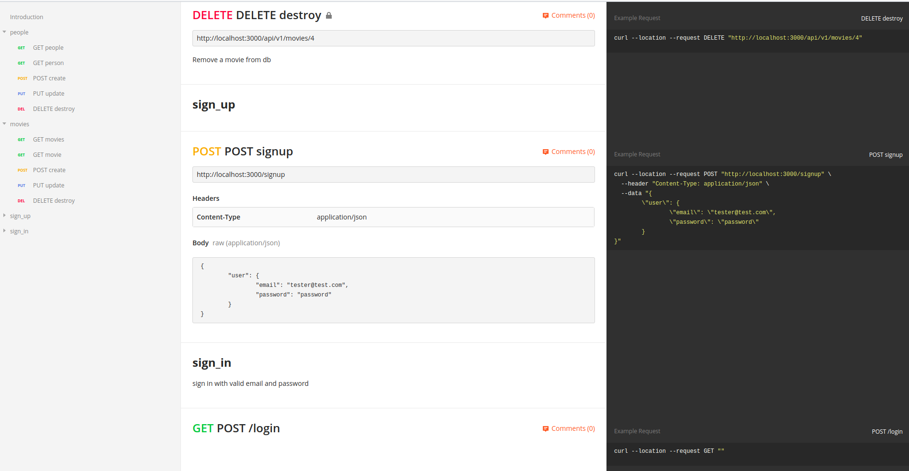

# MOVIE API

This api was developed using Ruby on Rails --api as challenge for IT Crowd Ruby on Rails position.

Things you may want to cover:

* Ruby version  
ruby 2.6.1p33 (2019-01-30 revision 66950) [x86_64-linux]
* System dependencies  
Ubuntu 1904
* Configuration  
git clone git@github.com:wildomonges/movies.git
* Database creation  
Ensure to have postgresql installed, if neccessary update .env file using the correct credentials  
rake db:create  
* Database initialization  
rake db:migrate  
rake db:seed  
* How to run the test suite  
rspec  
* Services (job queues, cache servers, search engines, etc.)  
Ransack: searcher  
Kaminari: pagination  
# Technologies used  
- Ruby on Rails (5.2.3): I decided to use this framework because the postion is for ruby on rails role.
- Postgresql: It is a great database engine to store a ton of movies as well as it has a big community.
- Authentication: Devise gem to generate user model and jwt-devise gem to generate token for the api.
- Ransack: used to search based on params sent from frontend.
- Kaminari: used to paginate pulled data from database.
- rspec-rails: gem used to tests models, requests.
- should-matcher: gem to validate using rspec with a readable syntaxis.
- faker: gem to generate faker data for testing purpose.
- factory-bot: gem to create faker model for testing purpose.
- interactor: gem to use object service to encapsulate business logic.
- puma: gem to use puma as server, it includes default with rails new project.
- enumerize: gem to define constants values into models
- roman-numerals: convert number to roman value
- dotenv: gem to use environment variables
- docker and docker-compose: to containerize app
# AVAILABLE ENDPOINTS  
* Go go /postman/ and you'll see a postman collection file, you can open and import the file into postman.  

# HOW TO TEST THE API
* Sign Up a new user
* Sign In with the user
* Get/Show Movies and People do not require authentication
* Create/Update/Destroy requires authentication
# INSTALLATION WITH DOCKER-COMPOSE  
* `cd movies_api/`
* `docker-compose build`
* `docker-compose run web rake db:create`
* `docker-compose run web rake db:migrate`
* `docker-compose run web rake db:seed`
* `docker-compose up`
* `Enter http://localhost:3000`
